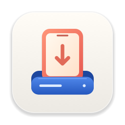

  

<h1 align="center">Naru (나루)</h1>

<b>Finder에서 내 폰을 편하게.</b> 
Android 폰을 연결하면 USB 메모리처럼 Finder 사이드바에 나타납니다.

<a href="README.md">English</a> · 한국어

---

## 소개

Naru는 Android 폰을 연결하는 순간 Finder 사이드바의 **위치** 항목에 꺼내기
버튼과 함께 표시해 줍니다. 일반 드라이브처럼 파일을 둘러보고, 열고, 복사하고,
편집하고, 이름을 바꾸고, 삭제할 수 있습니다.

- **USB 메모리처럼** — Finder 사이드바에 나타나고, Finder 창이 자동으로 열리며,
  디스크처럼 꺼낼 수 있습니다.
- **읽기와 쓰기 모두** — 파일을 드래그해서 주고받고, 문서를 바로 편집하고,
  폴더 생성·이름 변경·이동·삭제가 됩니다.
- **자동** — 메뉴 막대에 상주하며 로그인 시 실행됩니다. 폰을 꽂으면 마운트되고,
  뽑으면 알아서 정리됩니다.
- **ADB·개발자 옵션 불필요** — 폰에서는 **파일 전송**만 선택하면 됩니다.
- **Apple 공식 기술 기반** — Apple FSKit과 자체 구현한 USB MTP로 동작합니다.
  커널 확장이나 서드파티 드라이버가 없습니다.
- **개인정보 보호** — 모든 동작이 Mac 안에서만 이뤄집니다. 네트워크 연결도,
  데이터 수집도 하지 않습니다.

## 요구 사항

- **macOS 27** 이상을 실행하는 Apple 실리콘 Mac
- Android 폰과 데이터 전송이 되는 USB 케이블

## 설치

1. **[Releases](https://github.com/hamasang/Naru/releases/latest)** 에서 최신 **Naru-*버전*.dmg** 를 내려받습니다.
2. DMG를 열고 **Naru** 를 **응용 프로그램** 폴더로 드래그합니다.
3. **Naru** 를 실행합니다. 메뉴 막대에 아이콘이 나타납니다.
4. **파일 시스템 확장 프로그램을 켭니다** (처음 한 번).
   macOS는 서드파티 파일 시스템을 사용자가 직접 허용하도록 되어 있습니다.
   **시스템 설정 → 일반 → 로그인 항목 및 확장 프로그램 →
   파일 시스템 확장 프로그램 → Naru** 를 켜 주세요.
   꺼진 상태에서 폰을 연결하면 Naru가 알림을 띄웁니다. 알림을 누르면 해당
   설정 화면이 바로 열립니다.
5. 다음 권한 요청이 나오면 허용해 주세요.
   - **알림** — 확인이 필요한 상황을 알려 드립니다.
   - **Finder 제어** — 사이드바가 있는 일반 Finder 창으로 폰을 열기 위해 필요합니다.

Naru는 Apple Developer ID로 서명되고 Apple의 공증(notarization)을 받았기 때문에
Gatekeeper 경고 없이 실행됩니다.

## 사용법

1. USB 케이블로 폰을 연결하고 **잠금을 해제**합니다.
2. 폰의 USB 알림에서 **파일 전송**을 선택합니다.
3. Finder의 **위치** 항목에 폰이 나타나고 Finder 창이 열립니다.
4. 다 쓰셨으면 케이블을 뽑기 전에 사이드바의 **⏏** 버튼(또는 Naru 메뉴의
   **Eject**)을 눌러 주세요.

메뉴 막대 옵션:

| 항목 | 설명 |
|---|---|
| **Open in Finder** | 폰을 Finder 창으로 엽니다 |
| **Mount / Eject** | 직접 연결하거나 해제합니다 |
| **Mount Automatically** | 폰을 꽂을 때마다 자동으로 마운트합니다 (기본값: 켬) |
| **Launch at Login** | 로그인할 때 Naru를 실행합니다 (기본값: 켬) |

Finder에서 폰을 꺼낸 경우에는 케이블을 뽑았다가 다시 꽂기 전까지 다시
마운트하지 않습니다.

## 알아 두면 좋은 점

- **한 번에 한 앱만.** MTP로는 한 앱만 폰에 접근할 수 있습니다. Android File
  Transfer, OpenMTP, 이미지 캡처 같은 앱은 먼저 종료해 주세요.
- **폰 잠금을 해제하세요.** Android는 잠긴 상태에서 저장소를 보여 주지 않습니다.
  Naru가 1분 동안 계속 재시도하니 잠금만 풀어 주시면 됩니다.
- **폰에서 바꾼 내용**은 Finder에서 폴더를 다시 열면 반영됩니다
  (폴더 목록은 몇 초 간격으로 새로 읽습니다).
- **macOS 메타데이터는 Mac에만 남습니다.** `.DS_Store`, `._*` 같은 파일은 폰에
  기록되지 않습니다.
- **Naru를 업데이트한 뒤에는** 시스템 설정에서 확장 프로그램이 켜져 있는지
  확인해 주세요. 꺼져 있으면 Naru가 알려 드립니다.
- 파일을 그 자리에서 편집하는 기능은 Android의 MTP 확장 명령을 사용합니다.
  카메라나 MP3 플레이어 같은 다른 MTP 기기는 둘러보기와 읽기는 되지만 쓰기는
  안 될 수 있습니다.

## 문제 해결

| 증상 | 해결 방법 |
|---|---|
| 메뉴에 "File system extension is turned off" 표시 | 시스템 설정 → 일반 → 로그인 항목 및 확장 프로그램 → 파일 시스템 확장 프로그램에서 **Naru** 를 켜 주세요. |
| 폰을 꽂았는데 "No phone connected" 표시 | 폰에서 **파일 전송**을 선택하세요. 충전 전용 케이블일 수 있으니 다른 케이블이나 포트도 시도해 보세요. |
| 마운트 실패: "could not open the MTP interface" | 다른 앱이 폰을 사용 중입니다. 파일 전송·사진 앱을 종료해 주세요. |
| 폰이 응답하지 않음 | 케이블을 뽑았다가 다시 연결해 주세요. |
| Finder 창에 사이드바가 없음 | 시스템 설정 → 개인정보 보호 및 보안 → 자동화 → Finder에서 Naru를 허용해 주세요. |

## 동작 원리

FSKit은 블록 디바이스만 로컬·꺼내기 가능한 볼륨으로 보여 주는데, MTP로 연결된
폰은 블록 디바이스가 아닙니다. 그래서 폰이 연결되면 Naru가 1MB짜리 작은 "표식"
디스크 이미지를 붙입니다. macOS가 이 이미지를 Naru의 FSKit 확장에 넘기면, 확장은
이를 일반 로컬 볼륨으로 마운트하고 이미지 내용 대신 USB로 폰의 파일을 보여
줍니다. 확장은 IOKit으로 MTP와 직접 통신하며, 쓰기는 Android의 부분 편집 명령을
사용하기 때문에 파일이 폰에서 그 자리에서 수정됩니다.

## 고지

Naru는 독립 프로젝트이며 Google 또는 Apple과 제휴하거나 승인받지 않았습니다.
Android는 Google LLC의 상표입니다. macOS와 Finder는 Apple Inc.의 상표입니다.
